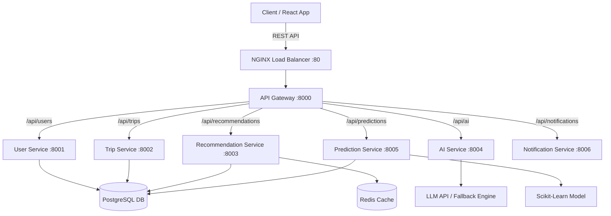

# TravelMind AI — Predictive Analytics & Personalized Travel Platform

> **Tagline:** "Predict. Personalize. Plan."  
> **Problem Statement:** Revolutionizing travel planning and booking with predictive price analytics and personalized recommendations.

TravelMind AI is a travel intelligence platform engineered with a modern microservices architecture. It combines **Scikit-Learn Machine Learning** for price predictions, a **multi-criteria weighted scoring engine** for destination matching, **LLM AI integration** with deterministic rule-based fallbacks, and a **Vite + React + Tailwind CSS** frontend.

---

## 🚀 System Features

- **User Authentication & Profiles (FR-01, FR-02, FR-03, FR-04)**: Registration, JWT authentication, user profile management, and onboarding preferences (budget, style, interests, home location).
- **Weighted Destination Recommendation Engine (FR-06)**: Deterministic match scoring using:
  $$\text{Final Score} = (\text{Budget} \times 0.25) + (\text{Interest} \times 0.30) + (\text{Weather} \times 0.15) + (\text{Activity} \times 0.15) + (\text{Distance} \times 0.15)$$
- **Scikit-Learn ML Price Predictor (FR-08)**: Predictive analytics model trained on historical pricing datasets forecasting price trends ("rising", "falling", "stable") and booking recommendations ("Book Now", "Wait for Drop").
- **Generative AI & Fallback Itinerary Generator (FR-09, FR-10, FR-11)**: Day-by-day interactive timeline itineraries generated via LLM API or deterministic fallback generator displaying `"AI personalization unavailable — showing standard itinerary."`
- **Budget Optimizer (FR-12)**: Financial allocation engine calculating category expenses (transportation, accommodation, food, activities, shopping, emergency reserve) with over-budget alerts.
- **Booking Recommendations (FR-13)**: Simulated flight, hotel, and activity cards.
- **Weather Integration (FR-07)**: Weather integration with Redis caching and fallback demo data.
- **Resilience & Observability (NFR-03, NFR-08)**: `X-Request-ID` request tracing, structured JSON logging, rate limiting, retries with exponential backoff, and circuit breakers.

---

## 🏗️ Architecture Overview



---

## 💻 Microservices Directory Structure

```
travelmind-ai/
├── frontend/             # React + Vite + Tailwind CSS + Framer Motion
├── gateway/              # FastAPI API Gateway with rate limiting & tracing
├── services/
│   ├── user-service/     # Auth, Registration, Profiles & Preferences
│   ├── trip-service/     # Trip CRUD & Itinerary Timeline Items
│   ├── recommendation-service/ # Weighted scoring recommendation engine
│   ├── ai-service/       # LLM integration & fallback itinerary generator
│   ├── prediction-service/# Scikit-Learn Linear Regression price predictor
│   └── notification-service/# Travel alerts & price drop notifications
├── shared/               # Database, auth, schemas, logging, resilience, cache
├── database/             # SQLAlchemy models & 15-destination seed script
├── nginx/                # Nginx load balancer configuration
├── tests/                # Pytest unit & integration test suites
├── docker-compose.yml    # Container orchestration manifest
└── README.md
```

---

## 🛠️ Quick Start & Startup Commands

### 1. Docker Startup (Preferred Single Command)
Ensure Docker Desktop is running, then execute:
```bash
docker compose up -d --build
```
Access the application at:
- **Frontend App**: `http://localhost`
- **API Gateway**: `http://localhost/api/health`

### 2. Local Python & Frontend Startup (Without Docker)

#### Step 1: Database Initialization & Seeding
```bash
# Seed SQLite/Postgres database with 15 destinations and ML training data
python database/seed/seed_data.py
```

#### Step 2: Run Microservices & Gateway
```bash
# Gateway (:8000)
python gateway/app/main.py

# Microservices
python services/user-service/app/main.py         # Port 8001
python services/trip-service/app/main.py         # Port 8002
python services/recommendation-service/app/main.py# Port 8003
python services/ai-service/app/main.py           # Port 8004
python services/prediction-service/app/main.py   # Port 8005
python services/notification-service/app/main.py # Port 8006
```

#### Step 3: Run Frontend
```bash
cd frontend
npm install
npm run dev
```
Open `http://localhost:3000` in your browser.

---

## 🧪 Automated Testing

Run the complete Pytest unit and integration test suite:
```bash
python -m pytest tests/ -v
```

---

## 🔗 Key API Endpoints

| Service | Method | Route | Description |
|---|---|---|---|
| User Service | `POST` | `/api/auth/register` | User registration |
| User Service | `POST` | `/api/auth/login` | User login & JWT issuance |
| User Service | `GET/PUT` | `/api/users/me/preferences` | Travel profile & preferences |
| Trip Service | `POST/GET` | `/api/trips` | Trip creation & listing |
| Trip Service | `GET` | `/api/trips/{id}/itinerary` | Fetch day-by-day itinerary |
| Recommendation | `POST` | `/api/recommendations` | Weighted destination scoring |
| Prediction | `POST` | `/api/predictions/price` | ML Price trend prediction |
| AI Service | `POST` | `/api/ai/itinerary` | Generate AI / Fallback itinerary |
| API Gateway | `GET` | `/api/health` | Aggregated cluster health check |

---

## ⚙️ Environment Configuration (`.env`)

```env
DEMO_MODE=true
DATABASE_URL=sqlite:///./travelmind.db
REDIS_URL=redis://localhost:6379/0
JWT_SECRET_KEY=super-secret-key-travelmind-ai-2026-production-grad
LLM_API_KEY=
LLM_MODEL=gpt-4o-mini
WEATHER_API_KEY=
```

---

## 📄 Documentation

- [REQUIREMENTS.md](file:///c:/Users/chand/OneDrive/Desktop/TravelMind%20AI/REQUIREMENTS.md): Complete Traceability Matrix (FR-01 to FR-16, NFR-01 to NFR-10)
- [SYSTEM_DESIGN.md](file:///c:/Users/chand/OneDrive/Desktop/TravelMind%20AI/SYSTEM_DESIGN.md): Architectural Specification & 9 Mermaid Diagrams
