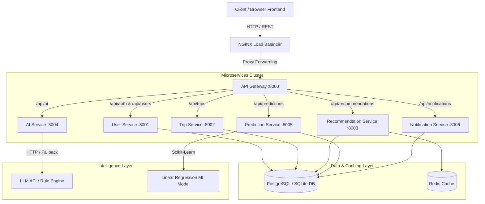
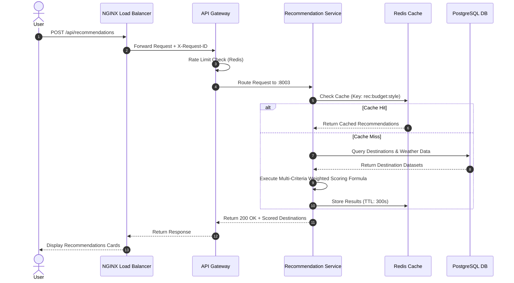
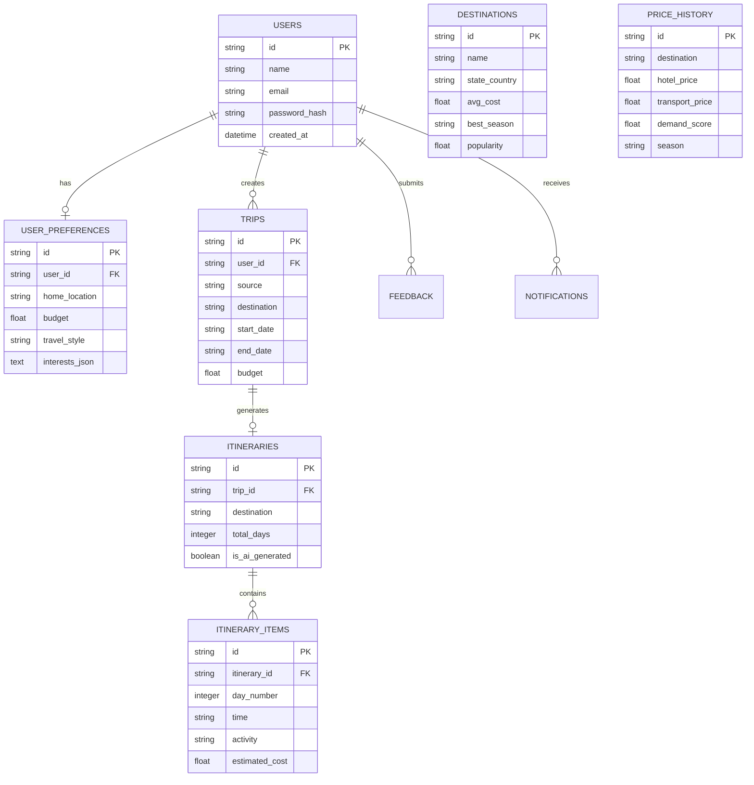
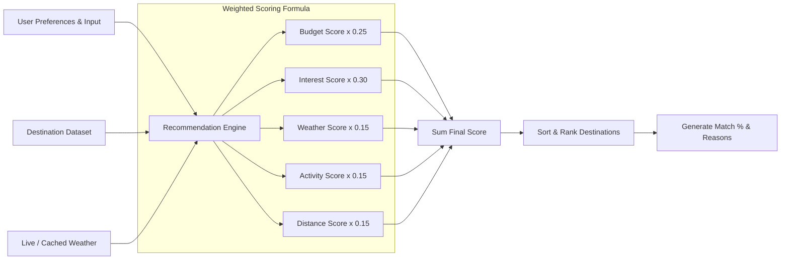
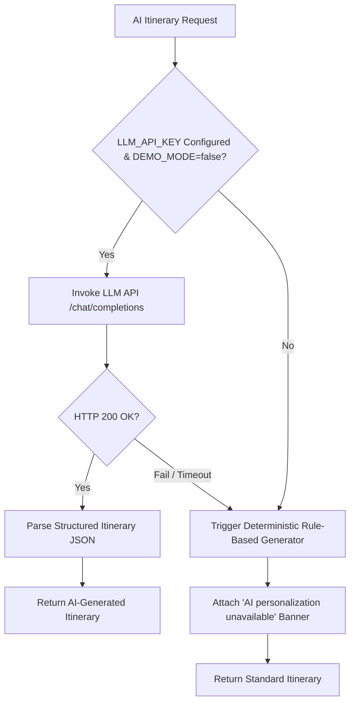
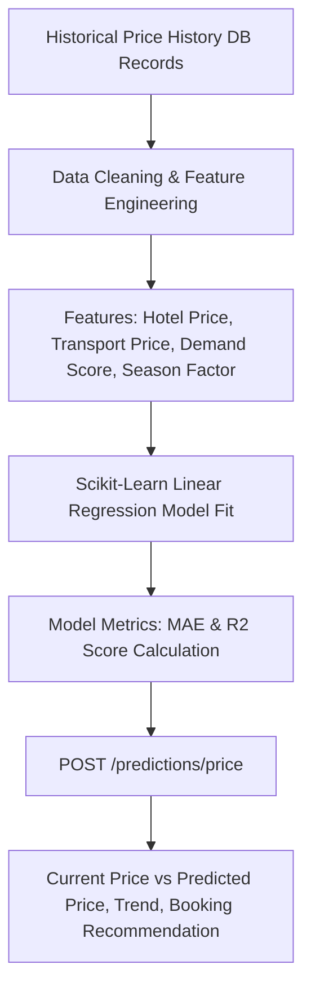
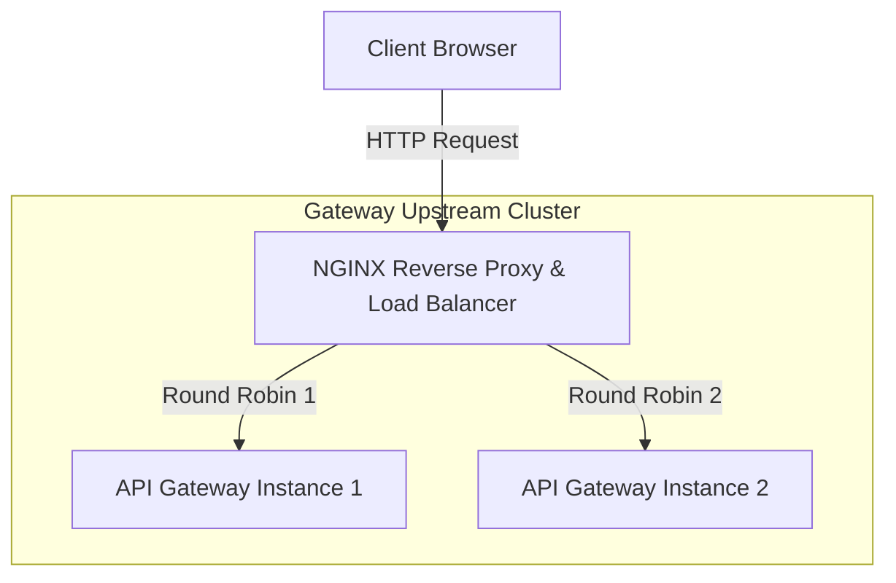

# System Design & Architecture Document — TravelMind AI

## 1. Problem Statement & High-Level Overview

TravelMind AI is an AI-powered travel intelligence platform that solves the complexity and fragmentation of modern trip planning by combining predictive price analytics, weighted destination recommendation algorithms, day-by-day itinerary timeline generation, and budget optimization.

---

## 2. High-Level Architecture Diagram

---

## 3. Microservices Architecture & Data Flow

---

## 4. Database ER Diagram

---

## 5. Recommendation Scoring Flow

---

## 6. AI Itinerary & Fallback Flow

---

## 7. Machine Learning Price Prediction Pipeline

---

## 8. Error Handling & Circuit Breaker Flow

```mermaid
stateDiagram-v2
    [*] --> Closed
    Closed --> Open: Failures >= 3
    Open --> HalfOpen: Cooldown Timeout (10s)
    HalfOpen --> Closed: Request Succeeds
    HalfOpen --> Open: Request Fails
    Open --> Fallback: Short-Circuit & Return Fallback Response
```

---

## 9. Nginx Load Balancing Diagram

---

## 10. Key System Design Concepts Implemented

1. **Client-Server Architecture**: Separates React Vite single page application from FastAPI backend services.
2. **RESTful Microservices**: Decoupled domain microservices (`user-service`, `trip-service`, `recommendation-service`, `prediction-service`, `ai-service`, `notification-service`).
3. **API Gateway**: Single entry point handling request routing, rate limiting, and request ID propagation.
4. **Nginx Load Balancer**: Reverse proxy routing requests with round-robin load balancing.
5. **Layered Repository Pattern**: Clean separation into Route Handlers -> Service Logic -> Repository Layer -> SQLAlchemy ORM.
6. **Stateless JWT Authentication**: Signed tokens containing user payload verified across all instances without shared session state.
7. **Redis Caching with Fallback**: Accelerated cache hits with graceful in-memory degradation if Redis is unreachable.
8. **Predictive Analytics (ML)**: Supervised Linear Regression predicting travel costs.
9. **Generative AI & Fallback**: Configurable LLM API integration with 100% reliable rule-based fallback generation.
10. **Resilience & Request Tracing**: Structured JSON logging embedding `X-Request-ID` across services, exponential backoff retries, and circuit breakers.
